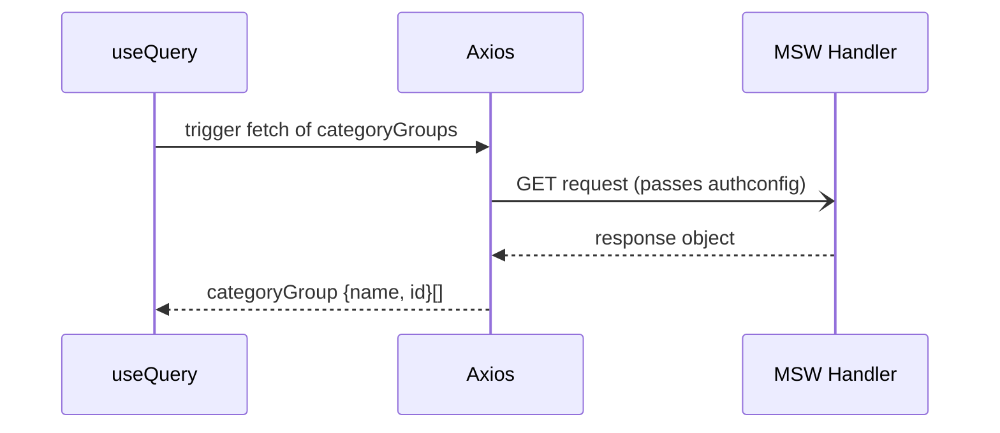

#DONE `useQuery` for "categoryGroups"
<!--
DONE:2021-11-24T13:54:25.666Z
completed:2021-11-24T13:54:25.667Z
-->

- we want to fetch all category groups for the logged in user
- [x] axios GET request (accepts the AuthConfig) => in the backend this returns the user with the `user_id`
- [x] mock handler for the GET request: query to fetch all category groups for lgged in user
- [x] return this, payload should be {name of category group, id of category group}
- generate tables for each `category_group.id`
  - input: TCategoryGroups
  - loop through TCategoryGroups and create the table with fixed column values and null row values
  - output: `<Table/>[]`
  <!-- order:-10
  TODO:2021-11-24T13:50:32.999Z
  DONE:2021-11-24T13:50:44.613Z
  completed:2021-11-24T13:50:44.613Z
  -->

